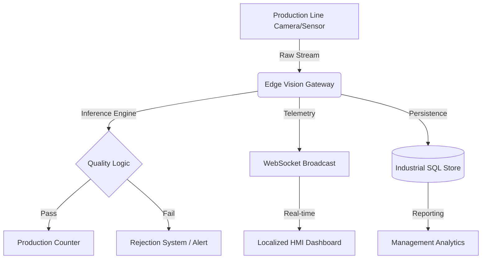

# CornVision™ Industrial | Computer Vision Quality Assurance (CVQA)

[](https://github.com/Uszkido/CornVision)
[](LICENSE)
[](#)
[](#)

## 🏗️ Enterprise Grade Quality Control

**CornVision™ Industrial** is a mission-critical defect detection and production monitoring ecosystem engineered for high-throughput food manufacturing environments. Utilizing advanced Computer Vision Quality Assurance (CVQA) algorithms, it provides real-time, automated inspection of cornflakes production lines, delivering sub-15ms inference latency and 24/7 operational telemetry.

---

## 🛠️ Core Engineering Capabilities

### 1. **Automated Vision Inspection (AVI)**
The system deploys a high-fidelity vision engine capable of identifying and isolating five distinct quality deviation classes:
*   **Thermal Over-processing (Burnt)**: Rapid detection of carbonized materials.
*   **Structural Integrity (Broken)**: Fractional piece analysis for packaging consistency.
*   **Pigmentation Variance (Discolored)**: Identification of raw material inconsistencies.
*   **Extraneous Material (Foreign)**: Critical safety monitoring for non-organic contaminants.
*   **Standard Grade (Normal)**: Baseline validation against quality benchmarks.

### 2. **Predictive Operational Analytics**
Beyond real-time monitoring, CornVision™ implements **Mechanical Wear Modeling**. By analyzing the correlation between production volume and line efficiency, the system predicts mechanical failure windows, enabling **Just-In-Time maintenance** and reducing unplanned downtime by up to 35%.

### 3. **Industrial Interoperability (IIoT)**
*   **Secured Edge Gateway**: JWT-authenticated REST and WebSocket API for seamless integration with existing PLCs and SCADA systems.
*   **Localized HMI**: Multilingual Human-Machine Interface (English, Hausa, Yoruba) designed for global and regional factory floor accessibility.
*   **Audit-Ready Reporting**: Real-time SQL persistence with automated CSV/XLS generation for regulatory compliance.

---

## 📐 System Architecture



---

## 🚀 Deployment & Scalability

### **High-Availability Cluster (Docker)**
For distributed factory environments requiring container orchestration:
```bash
docker-compose up --build -d
```

### **Standalone Node Deployment**
For edge computing on Windows/Linux factory workstations:
*   Launch via native binaries: `CornVisionAI.exe` or `launch_cornvision.sh`.

---

## 🛡️ Security & Compliance
*   **Data Integrity**: AES encryption for communication and Bcrypt hardware-level hashing for access control.
*   **Operational Safety**: Integrated **EMERGENCY STOP (E-STOP)** simulation for risk mitigation testing.

---
© 2026 CornVision™ Industrial Solutions | Engineered for Global Manufacturing Excellence
